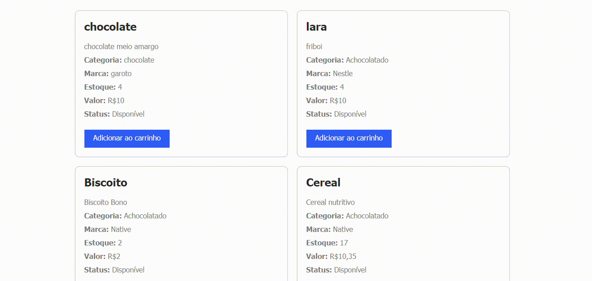

# 😶‍🌫️gestao-ecommerce-cadastro marca
Atividade feita em sala com o auxilio do professor leonardo fomos abordado a continuar a atividade.
Nessa atividade fazemos um site que consiste em algumas paginas de cadastro de produtos, marcas e categorias.
Este projeto faz parte do sistema de e-commerce, focado na implementação do cadastro de marcas no banco de dados. Seguindo o exemplo do cadastro de categorias, esta tarefa visa adicionar a funcionalidade de gerenciar marcas no sistema.

 
 

 ## 🙉Funções
 Cadastrar e salvar pedido  
 Cadastrar produtos  
 Selecionar produtos suas marcas e categorias  
 Visualizar estoque  
 
 ## Adicionar ao carrinho:
 Basta escolher qual item voce deseja, adicionar a quantidade do item e clique em OK, seu pedido será finalizado.  

 

 ## Adicionar nova marcas:
Para cadastrar uma nova marca, siga os passos abaixo:  

Acesse a página de cadastro de marcas.  
Preencha o formulário com o nome da marca.  
Clique no botão CADASTRAR.  
`A marca sera atualizada automaticamente no banco de dados.`

 ## 🐓Tecnologias reutilizadas:
 * MySql
 * HTML
 * CSS
 * PHP

## scripts usados 
include('controller/conexao.php');  
- 
mysqli_close($mysqli);  
- 
INSERT INTO  
- 
mysqli_query  
- 
mysqli_error  
- 

 ## 🌻 Autores
 * [Lara](https://github.com/laraassuncao18)
 * [Leo](https://github.com/LeonardoRochaMarista)