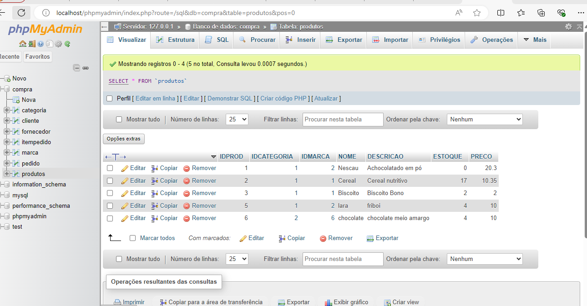

# 😶‍🌫️gestao-ecommerce-cadastro marca
Atividade feita em sala com o auxilio do professor leonardo fomos abordado a continuar a atividade.
Nessa atividade fazemos um site que consiste em algumas paginas de cadastro de produtos, marcas e categorias.
Este projeto faz parte do sistema de e-commerce, focado na implementação do cadastro de marcas no banco de dados. Seguindo o exemplo do cadastro de categorias, esta tarefa visa adicionar a funcionalidade de gerenciar marcas no sistema.

 
 

 ## 🙉Funções
 cadastrar e salvar pedido, cadastrar produtos, selecionar produtos suas marcas e categorias.
 
 ## adicionar ao carrinho:
 Basta escolher qual item voce deseja adicionar o numero ou quantidade do item e o botão OK, e finalize o pedido.

 

 ## adicionar nova marcas:
Para cadastrar uma nova marca, siga os passos abaixo:

Acesse a página de cadastro de marcas.
Preencha o formulário com o nome da marca.
Clique no botão CADASTRAR.

 ## 🐓Tecnologias reutilizadas:
 * vs code
 * git hub
 * google
 * xampp
 
 
 ## 🌻 Autores
 * [Lara](https://github.com/laraassuncao18)
 * [Leo](https://github.com/LeonardoRochaMarista)